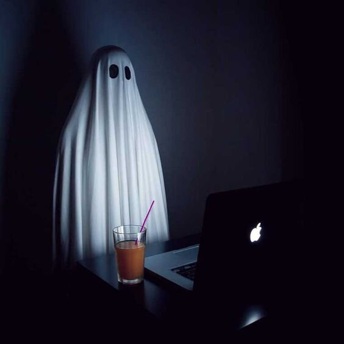

<html>
<head>
<meta charset="UTF-8">
<title>CV</title>
       <header> <strong>Welcome to my page Xd </strong></header>
</head>
<body>
<main>

    

my cv 

<ol>
<li> Ivanov Nikita </li>
<li>my number +7 905 408 26 34 
Discord nickname: nikita (@1it9) or ghoust9481 </li>
<li>A little about me now I'm 18 years old I've been learning programming languages for about 6 months I'm studying at a technical school my strengths are diligence, desire to develop and quick adaptation to new things. I really want to study here, I like it very much and I would like to work in it.</li>
 <li>I have an average knowledge of html and css and very little js.</li>
 <li>function multiply(a, b){
 return a * b
}
</li>
   <li>I have no work experience.</li>
   <li> Education 9 grades and 2 courses of Web and multimedia application developer (still studying).</li>
   <li> English d3 max.</li>
</main>
</body>
<footer>
              <p1> This right i win </p1>
		 </footer>
    </html>